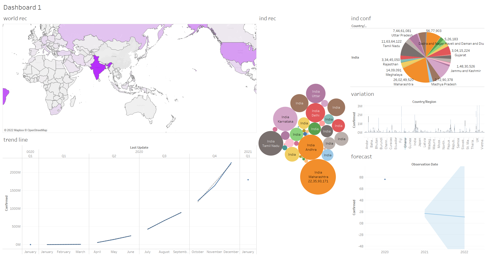

 
  
  &#xa0;

<h1 align="center">Covid-19 Dashboard in Tableau</h1>

<!-- 

  

  

  

  

   

  

  

 -->

  <a href="#dart-about">About</a> &#xa0; | &#xa0; 
  <a href="#sparkles-features">Features</a> &#xa0; | &#xa0;
  <a href="#rocket-technologies">Technologies</a> &#xa0; | &#xa0;
  <a href="https://github.com/muskaan712" target="_blank">Author</a>

 

## :dart: About ##

Tableau is a powerful Data Visualization software, and much of its popularity is due to its interactive visualizations & user-friendly interface.
With the Covid-19 Pandemic raging throughout the world, the availability of discrete data is huge. In today’s data-driven world, this also means the creation of new data, and in turn, a need for new insights.
Combining Tableau’s visualization prowess with the constantly growing Covid Data, in the form of a Dashboard, will help us get a bird’s-eye view of the current scenario.

## :sparkles: The dashboard answers the following- ##
:heavy_check_mark: Recoveries made in the globe;\
:heavy_check_mark: Recoveries made in India;\
:heavy_check_mark: Confirmed Cases in the globe;\
:heavy_check_mark: Confirmed Cases in India;\
:heavy_check_mark: Trend Line of Confirmed Cases;\
:heavy_check_mark: Rate of Death;\
:heavy_check_mark: Variation using box plots;\
:heavy_check_mark: Forecast of confirmed Cases for 2022;\

## :rocket: Technologies ##

The following tool was used in this project:

- [Tableau](https://www.tableau.com/)

Made with :heart: by <a href="https://github.com/muskaan712" target="_blank">Muskaan Chopra</a>

&#xa0;

<a href="#top">Back to top</a>
